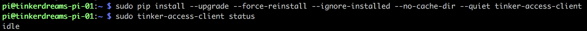

# tinker-access-client

The tinker-access-client is the client piece of the tinkerAccess system, a [Raspberry Pi](https://www.raspberrypi.org/products/) based access control system that can be used to prevent unauthorized users from using devices that require special training, it could also conceivable be used to control electronic lock boxes, or doors.

The system was originally designed and created by [Matt Stallard](https://github.com/mstallard), [Ron Thomas](https://github.com/RonaldThomas), and [Matt Peopping](https://github.com/analogpixel) for [TinkerMill](http://www.tinkermill.org) a makerspace in [Longmont, CO](https://www.google.com/maps/place/Longmont,+CO/@40.1679379,-105.1678944,12z/data=!3m1!4b1!4m5!3m4!1s0x876bf908d5cc3349:0xc17da1eef3a32735!8m2!3d40.1672068!4d-105.1019275). It is continually being maintained and enhanced by other contributors in the community.

The client software is a [Python 2.7](https://www.python.org/download/releases/2.7/) service designed to run on the [Raspbian OS](https://www.raspberrypi.org/downloads/raspbian/). The service is responsible for coordinating activity between the RPi's peripherals (i.e. RFID reader, LCD, etc..) and the GPIO, as well as communicating with the [tinker-access-server](../tinker_access_server/README.md) for activity logging, authentication & authorization.

Official releases of the client software are packaged and published to [PyPI - the Python Package Index ](https://pypi.python.org/pypi/tinker-access-client/)  

## Prerequisites
You will need to complete these [prerequisites](docs/prerequisites.md) before installing the tinker-access-client.

## Installing the tinker-access-client:

By default, the tinker-access-client is installed as a service that starts immediately, as well as upon reboot of the device.

Use the following command to the latest version of the client:

```commandline
sudo pip install --upgrade --force-reinstall --ignore-installed --no-cache-dir tinker-access-client
```


Query the client status. If all goes as planned, the expected output should be *'idle'*:

```commandline
sudo tinker-access-client status
```



If you didn't get the expected output, see the [troubleshooting guide](docs/troubleshooting.md).

See the [development guide](docs/development.md) for special installation instructions, best practices and other helpful information for maintaining & enhancing the code for the future.

## Using the tinker-access-client command-line tools:
The remaining information in this guide explains some ways to customize the behavior of the client, control the client, and/or get feedback about the state of the client.

All of the following commands and options are available by using the  --help option on the command line.
```
sudo tinker-access-client --help
```

#### Usage:

```
sudo tinker-access-client <command> [options]
```

#### Commands:
- __start__ : This command will start the tinker-access-client process.

- __stop__ : This command will stop the tinker-access-client process.

- __status__ : This command will return the current state of the tinker-access-client (i.e. initialized, idle, in_use, in_training, terminated).

- __update__ : This command will update the tinker-access-client from the [PyPI - the Python Package Index ](https://pypi.python.org/pypi/tinker-access-client/).  

  By default the latest published version will be installed.
	 Optionally a second argument can be provided to specify the specific version desired.
   ```
	 sudo tinker-access-client update 2017.2.14.441
   ```

- __remove__ : This command will stop the tinker-access-client process, remove the service and all other artifacts installed via PIP.  

- __restart__ : This command will stop and restart the tinker-access-client process, this can be useful to reload after code changes.

#### Options:

The default value of most of these options can be overridden in a config file. Specifying options via the command line can be useful for debugging purposes.

For example creating this file would enable the auto_update feature, and set the logging level to debug:  

File: `/etc/tinker-access-client.conf`
```
[config]
log_level: 10
auto_update: true
```

- __--version__: Show the current version number and exit

- __-h, --help__: Show the help message and exit

- __--config-file=[config_file]__: The location of the config file to use [default:'/etc/tinker-access-client.conf'] a non-default command-line option value will have precedence over a config-file option value

- __--logging-config-file=[logging_config_file]__: The location of a logging config file to use [default:'/etc/tinker-access-client.logging.conf'] If this file is present, it will override the default logging configuration including the --log-level and --log-file options

- __--debug__: Run in the foreground (a.k.a debug mode) [default:'False']

- __--force-update__: By default, the update command will not do an update if the current version matches the latest version published to [PyPI - the Python Package Index ](https://pypi.python.org/pypi/tinker-access-client/). This option bypasses the version check, and will force a re-install [default:'False']

- __--auto-update=[auto_update]__: If configured, the client will periodically check if a newer version has been published to [PyPI - the Python Package Index ](https://pypi.python.org/pypi/tinker-access-client/). If a new version is found, it will be install it automatically.
[default:'False']

- __--auto-update-interval=[auto_update_interval]__: The period (specified in minutes) that the [PyPI - the Python Package Index ](https://pypi.python.org/pypi/tinker-access-client/) should be checked for a new version of the client. [default:5]

- __--log-file=[log_file]__: The path and name of the log file [default:'/var/log/tinker-access-client.log']

- __--status-file=[status_file]__: The path and name of the status file, the contents of this file will always reflect the current state of the client. (i.e. initialized, idle, in_use, in_training, terminated) A missing file indicates the client is not running [default:'/var/log/tinker-access-client.status']

- __--pid-file=[pid_file]__: The path and name of the client daemon's pid file [default:'/var/run/tinker-access-client.pid']

- __--log-level=[log_level]__: The log level to use [default:40]

- __--server-address=[server_address]__: The [tinker-access-server's](../tinker_access_server/README.md) api address
[default:'http://localhost:5000']

- __--device-id=[device_id]__: The unique identifier for this client, as configured in the [tinker-access-server](../tinker_access_server/README.md) [default:'none']

- __--logout-coast-time=[logout_coast_time]__: A fixed number of seconds to wait for the physical machine to stop after power has been disabled. (i.e. a blade to stop spinning etc...) [default:0]

- __--max-power-down-timeout=[max_power_down_timeout]__: The maximum number of seconds to wait for the current sense pin to go low during logout/shutdown [default:5]

- __--reboot-on-error=[reboot_on_error]__: Any unhandled errors will cause the device to reboot after the specified --reboot-delay. [default:'False']

  This behavior is only supported on Raspberry Pi devices.

- __--reboot-delay=[reboot_delay]__: The number of seconds to wait before attempting to reboot the device after an unhandled error. [default:5]

- __--pin-logout=[pin_logout]__: The logout button pin [default:16]

- __--pin-power-relay=[pin_power_relay]__: The power relay pin [default:17]

- __--pin-led-red=[pin_led_red]__: The red led pin [default:21]

- __--pin-led-green=[pin_led_green]__: The green led pin [default:19]

- __--pin-led-blue=[pin_led_blue]__: The blue led pin [default:20]

- __--pin-current-sense=[pin_current_sense]__: The current sense pin [default:12]

- __--serial-port-name=[serial_port_name]__: The serial port attached to the RFID reader [default:'/dev/ttyUSB0']

- __--serial-port-speed=[serial_port_speed]__: The serial port speed to use [default:9600]
