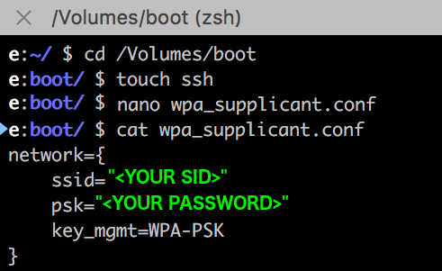

## Creating a tinker-access-client boot image:

This document details the steps required to create a [Raspbian OS](https://www.raspberrypi.org/downloads/raspbian/) boot image and prepare it for the tinker-access-client.

There are many such guides that you can find, some with much more info, some with much less. I will let you pick your own poison, but its hard to beat [this guide](https://www.raspberrypi.org/documentation/installation/installing-images/README.md).

The intent of this guide is to document a couple of additional steps that may not be immediately apparent. You will want to do these steps **before** you write the image to your SD card.

1. Mount the image locally, so that you can add a couple of important files at the root of the boot image.

1. Create an empty file named 'ssh', this will automatically enable the ssh service when the Raspberry Pi boots up, this is normally disabled by default.

2. Create a file named 'wpa_supplicant.conf', edit it and add your wifi network details.  
On boot the Raspberry Pi will copy this file to the appropriate location and use it to connect to your wifi network so that you can continue to configure it via ssh.

  

3. Now you can unmount image from your local machine, and continue with the steps to write this image to an SD card, using your preferred method.
