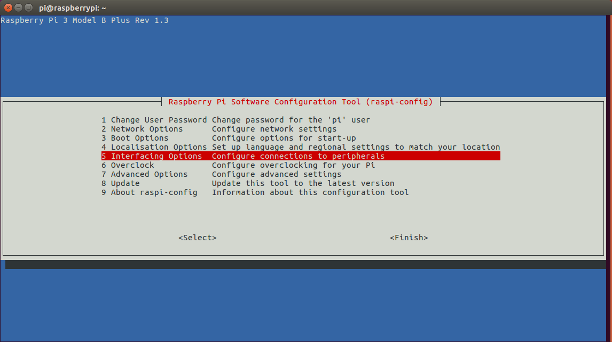
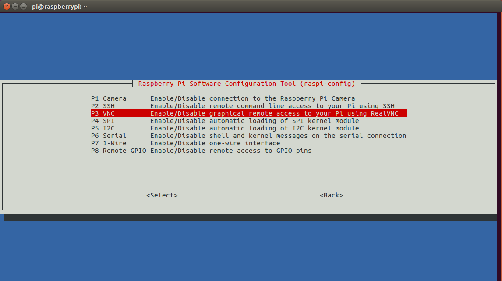
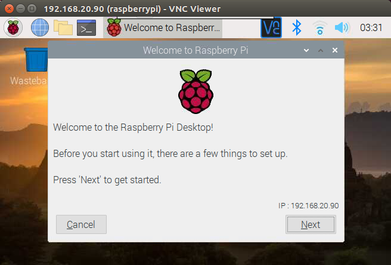
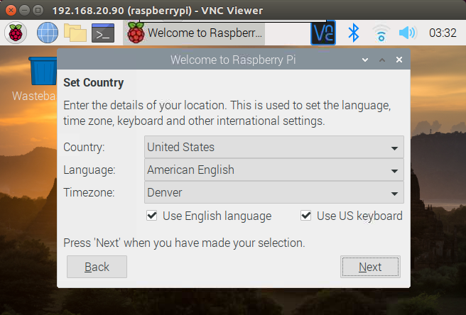
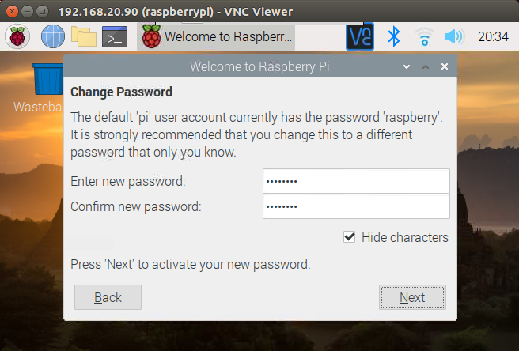
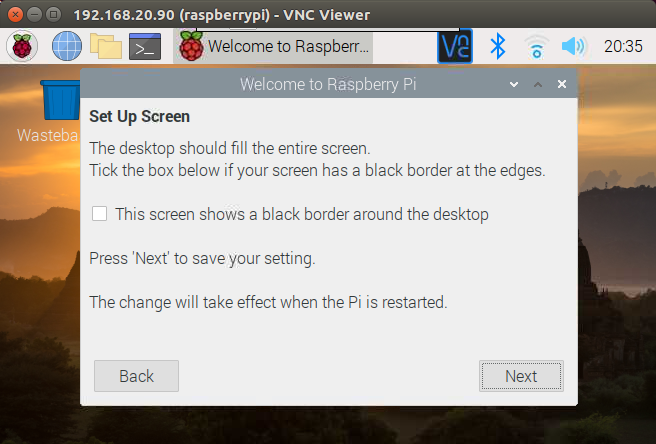
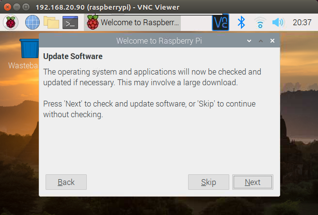
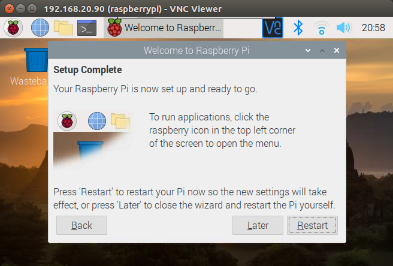

## Creating a tinker-access-client boot image:

This document details the steps required to create a [Raspberry Pi OS](https://www.raspberrypi.org/downloads/raspberry-pi-os/) boot image and prepare it for the tinker-access-client.

There are many such guides that you can find, some with much more info, some with much less. I will let you pick your own poison, but it is hard to beat [this guide](https://www.raspberrypi.org/documentation/installation/installing-images/README.md).

The intent of this guide is to document a few additional steps that will facilitate the install in a completely headless mode (i.e., not requiring a monitor and keyboard). In order to do a completely headless setup, there needs to be a method to determine the IP address assigned to the Pi, external to the Pi. Access to the network router/DHCP server would typically be the desired method. If such a method is not available, then the initial stages of setup will need to use a monitor and keyboard, until the IP address can be determined and the SSH and/or VNC services enabled. After that, the setup can continue in a headless mode.

1. Download the [Raspberry Pi OS image](https://www.raspberrypi.org/downloads/raspberry-pi-os/).

   The "Raspberry Pi OS (32-bit) with desktop" is the typical desired image. It is a somewhat light-weight image, in that it does not include all of the recommended software of a full install, but it still includes the desktop.

2. Write the image to an SD card.

   Using your preferred method, write the downloaded image to an SD card. The standard method is the [Raspberry Pi Imager](https://www.raspberrypi.org/documentation/installation/installing-images/README.md). Other methods are described in the link for various OSes.

#### Steps 3-8 are optional. If you do not want to begin the install in a completely headless mode, and are starting with a keyboard and monitor, you can install the imaged SD card in the Pi, power it up, and continue the setup starting at step 9.

3. Mount the *boot* partition of the SD card locally, so that you can add a couple of files to the root directory of the *boot* partition.

4. [Enable SSH for a headless Pi](https://www.raspberrypi.org/documentation/remote-access/ssh/#:~:text=Enable%20SSH%20on%20a%20headless%20Raspberry%20Pi).

   Create an empty file named *ssh* at the root of the *boot* partition. This will automatically enable the SSH service when the Raspberry Pi boots up, which is normally disabled by default.

   From the root directory of the locally mounted *boot* partition, run the following command:
   ```
   sudo touch ssh
   ```

5. [Setup WiFi for a headless Pi](https://www.raspberrypi.org/documentation/configuration/wireless/headless.md).

   Create a file named *wpa_supplicant.conf* in the root directory of the *boot* partition that contains your WiFi credentials. On the initial boot, the Raspberry Pi will copy this file to the appropriate location and use it to connect to your WiFi network so that you can continue to configure it via SSH.

   From the root directory of the locally mounted *boot* partition, run the following command:
   ```
   sudo nano wpa_supplicant.conf
   ```

   Paste the following contents into the file and save. Modify the SSID and password to match your actual WiFi access point credentials.
   ```
   ctrl_interface=DIR=/var/run/wpa_supplicant GROUP=netdev
   update_config=1
   country=US
   
   network={
    ssid="<Name of your wireless LAN>"
    psk="<Password for your wireless LAN>"
   }
   ```

6. Unmount the *boot* partition, remove the SD card, install it in the Raspberry Pi, and power it up.

7. Enable the VNC server to facilitate completion of the install via the desktop on a VNC client running locally.

   From your local machine, ssh into the Raspberry Pi. Use the actual IP address assigned to the Pi. For the default *pi* username, the default password is *raspberry*:
   ```
   ssh pi@192.168.20.90
   ```

   Enable the VNC server via *raspi-config*:
   ```
   sudo raspi-config
   ```

   Select *Interfacing Options* from the raspi-config menu:

   

   Next, select *VNC* from the raspi-config menu, and then enable the VNC server.

   

   After enabling the VNC server, exit the raspi-config, and exit the SSH session. The VNC server should be started and does not require a reboot of the Pi.

8. Connect to the Raspberry Pi via a RealVNC Viewer client running on your local machine.

   Use the assigned IP address to connect and use the default username *pi* and password *raspberry*. The default password can be changed in the next step.

9. Complete the Raspberry Pi OS installation and update.

   After the initial boot, the following dialog box should be displayed to continue the installation process. Click 'Next' to continue the setup:

   

   Set the Country and Timezone:

   

   Change the default *pi* username password in this step:

   

   Leave the 'fill entire screen' checkbox unchecked:

   

   Click 'Next' to download and install updates to the OS. This will take a while to complete:

   

   If the download and update fails for any reason, the update can be completed at the command line with the following commands:
   ```
   sudo apt update
   sudo apt upgrade
   ```

   After the update completes, the following dialog will be displayed. If you want to change the default screen resolution when connected to the Pi via VNC, without a monitor, do not reboot just yet, and click 'Later'. Complete step 10 before rebooting. Otherwise, if you do not want to change the default screen resolution, go ahead and reboot the Pi by clicking 'Restart':

   

10. Change the default screen resolution.

    This step is optional, but should be completed if you want the default VNC screen resolution to be something larger, when no monitor is connected. Edit the */boot/config.txt* file to change the default screen resolution. From a terminal window on the Pi, run the following command:
    ```
    sudo nano /boot/config.txt
    ```

    Uncomment and modify the contents of the following lines to look like the following. This will change the screen resolution to CEA mode, 1920x1080, 60Hz, 16:9 aspect ratio:
    ```
    # uncomment if hdmi display is not detected and composite is being output
    hdmi_force_hotplug=1
    
    # uncomment to force a specific HDMI mode (this will force VGA)
    hdmi_group=1
    hdmi_mode=16
    ```

    Reboot the Pi:
    ```
    sudo reboot
    ```
    
#### The setup of the Raspberry Pi OS boot image for the tinker-access-client is complete. You can continue with the rest of the client [prerequisites](prerequisites.md)
