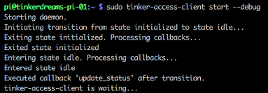

### Development:

For development purposes, the client code can be installed from many different types of locations (i.e., the local file system and other [GitHub](https://github.com) branches). You can find additional examples [here](http://www.developerfiles.com/pip-install-from-local-git-repository/).

You can use the [-e, --editable](https://pip.pypa.io/en/latest/reference/pip_install/#cmdoption-e) flag to install the package in editable mode. This will create a symlink from dist-packages to your local development directory so you do not need to re-install each time you change a file.
```
sudo pip install -e <path to your local development directory where setup.py resides>
```

I generally do not do development on the Raspberry Pi. I setup a task to synchronize my files from my development machine and the Pi. PyCharm makes this easy with [deployment configuration](https://www.jetbrains.com/help/phpstorm/2016.3/deployment.html), but there are many other options to synchronize a directory with a remote directory.

Here are examples of my [connection](images/deployment_configuration_connection.png) & [mappings](images/deployment_configuration_mappings.png) configuration.

After changing a local file, ssh into the Raspberry Pi and restart the client software to see your changes take affect.
```
sudo tinker-access-client restart
```

##### Run in stand-alone mode:

When you install the client using [-e, --editable ](https://pip.pypa.io/en/latest/reference/pip_install/#cmdoption-e) option flag, the client will NOT install the service piece. You will get the command line support tools, but you will not automatically get the service piece. This means that any service related commands will not work (i.e., *sudo service tinker-access-client start*) and the client will not automatically start upon boot of the device.

If you really do want the service piece, you can create it with these commands, pointing the symlink to the same location that you installed your package from using the -e flag. Normally this is not required.
```
# create the startup service symlink manually
sudo ln -sf ~/projects/tinkerAccess/tinker_access_client/tinker_access_client/Service.py /etc/init.d/tinker-access-client

# grant execute permission on the Service.py file
sudo chmod 0755 ~/projects/tinkerAccess/tinker_access_client/tinker_access_client/Service.py

#configure the service to start on boot
sudo update-rc.d -f tinker-access-client defaults 91

#start the service
sudo service tinker-access-client start
```

You can run the client as a stand alone script in the foreground if you do not want to install a full blown service. This is helpful for testing and development purposes. You can also control the configuration in debug mode with additional command line switches. However, if you want complete control via the command line, and do not want the config file overriding your command line switches, be sure to rename or delete the */etc/tinker-access-client.conf* file.
```
sudo tinker-access-client start --debug
```



### Testing/Emulation:

See the [testing](/tinker_access_client/tests/README.md) documentation for more info.

### Logging:

If you are not using debug mode, but want to watch the log messages you can use the following command:
```
sudo tail -f /var/log/tinker-access-client.log
```
