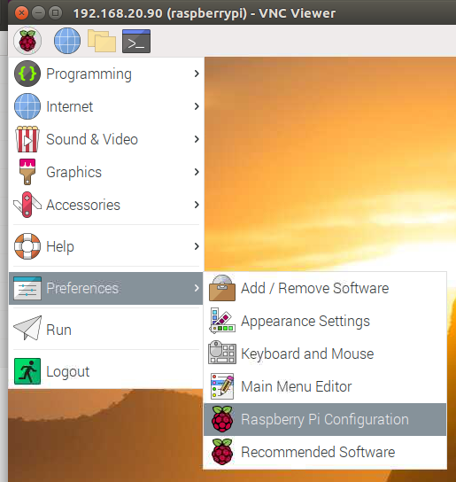
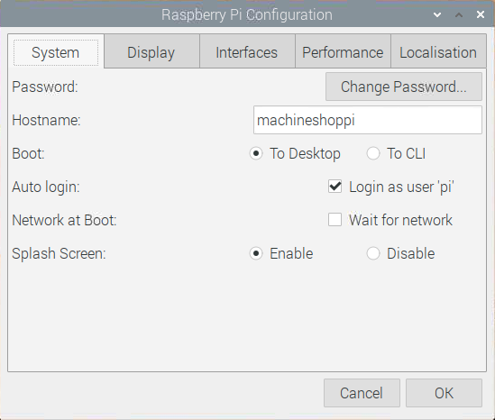
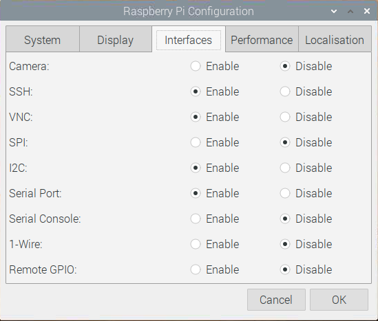

# Prerequisites:
1. Build the custom tinkerAccess [Raspberry Pi HAT](https://www.raspberrypi.org/blog/introducing-raspberry-pi-hats/) as described [here](/Hardware/).

2. Create a [Raspberry Pi OS](https://www.raspberrypi.org/downloads/raspberry-pi-os/) boot image as described in detail [here](bootimage.md).

3. Modify the Raspberry Pi Configuration.

   Launch the 'Raspberry Pi Configuration' as shown below:

   

   Change the Hostname of the client, and change the default password if not completed in an earlier step:

   

   Setup the Interfaces as shown below:

   

   SSH and VNC should be enabled for headless remote access to the client. 'I2C' needs to be enabled for the client to communicate to the LCD display. The 'Serial Port' needs to be enabled for the client to communicate to the RFID, but the 'Serial Console' needs to be disabled so that it does not interfere with the RFID communication.

   Reboot the Pi after making changes to the Raspberry Pi Configuration.

4. Reconnect to your Pi via [SSH](https://www.raspberrypi.org/documentation/remote-access/ssh/README.md) or [VNC](https://www.raspberrypi.org/documentation/remote-access/vnc/README.md).

5. Install the python package manager (a.k.a 'pip').

   **IMPORTANT**: If you have just created a new image using the previous mentioned guide, or you are using an existing image...

   Ensure you have the latest version of [pip](https://pip.pypa.io/en/stable) and its related setuptools installed. If you do not complete this step, you will almost certainly __not__ have a good time. Version issues with PIP and its related setuptools can be inconsistent, confusing, and difficult to resolve. It is better to just avoid it now and ensure that they are updated. 

   Many references that you can find, say to upgrade pip with the command 'pip install --upgrade pip setuptools'. However, it is not advisable to upgrade the system version of pip with this method. It can create all sorts of issues if the system maintainer version is upgraded via this method. References to many of these issues are described [here](https://github.com/pypa/pip/issues/5599).

   The recommended upgrade process is shown below:
   ```
   sudo apt update
   sudo apt install python-pip python-setuptools
   ```

6. Install pigpio

   For the PWM current sense level detect output, the Python code uses the PWM features of the pigpio library. Therefore, the pigpio library needs to be installed and the daemon needs to be started at bootup. The following command will ensure the pigpio library is installed and the daemon running at bootup:
   ```
   sudo apt install pigpio
   sudo systemctl enable pigpiod
   sudo reboot
   ```

   After reboot check the status of the pigpiod daemon with the following command:
   ```
   sudo systemctl status pigpiod
   ```
   
7. Continue with [client only install](/tinker_access_client/README.md) or [combined client/server install](/README.md).
